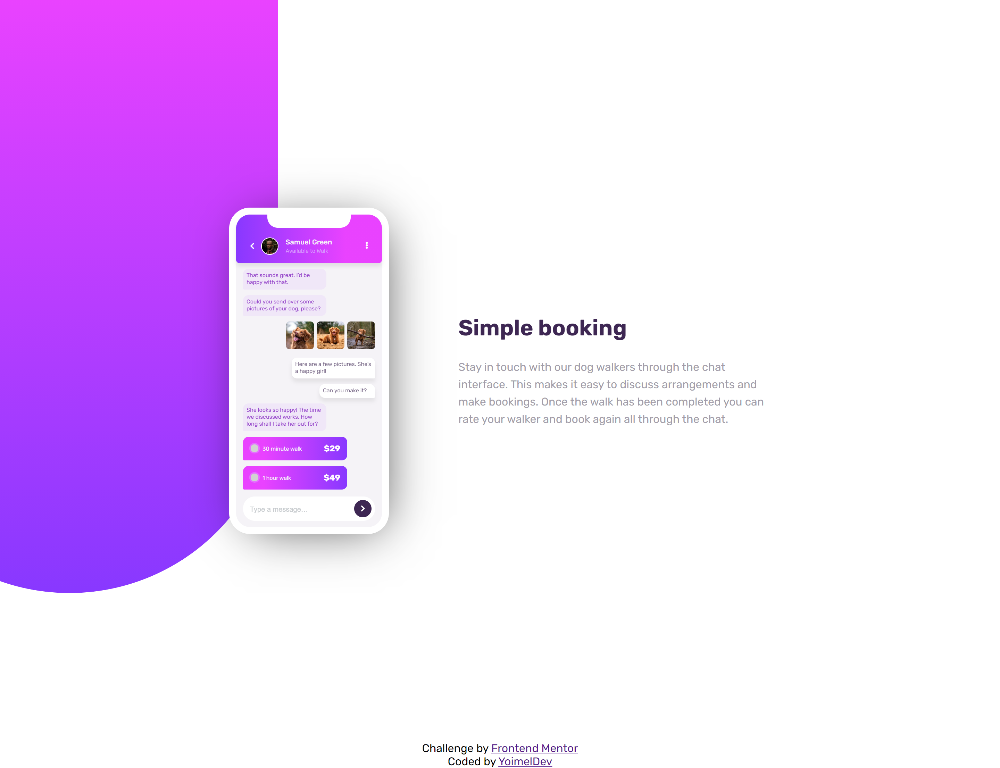
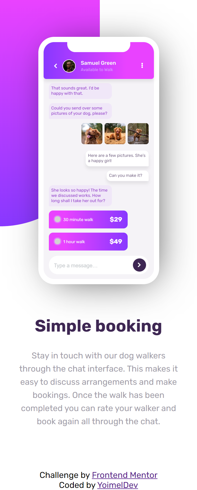

# Frontend Mentor - Chat app CSS illustration

## ✍🏻 Description

[Chat app CSS illustration, challenge on Frontend Mentor](https://www.frontendmentor.io/challenges/chat-app-css-illustration-O5auMkFqY), where i put into practice my CSS skills, trying to make it as close as possible to the design provided.

## 🎨 Preview

You can see the result here → [Chat app CSS illustration](https://chat-app-illustration-yoimeldev.netlify.app/)

    
🖥️ Desktop version

    
📱 Mobile version

## :computer: Technologies

- HTML5
- CSS3
- Flexbox
- Grid
- Mobile-first workflow
